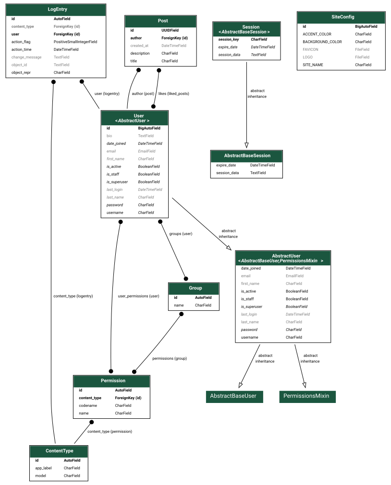

MintBoard is a fully customizable social network built with Django. You can change colors, logo, features and more - all from the admin panel, without touching a single line of code.


## STATUS: IN DEVELOPMENT

Current version is under active development. Full release expected on 28 August.

## Models Graph




## Features

- User authentication system (login, registration, profile management)
- Post creation and viewing
- Like/unlike posts
- Infinite scroll with load-more functionality
- Customizable site appearance via admin panel:
  - Site name
  - Accent color (HEX)
  - Background color (HEX)
  - Logo (SVG)
  - Favicon (SVG)
- User profiles with bio
- Responsive design
- UUID primary keys for posts


## Technology Stack

- Python 3.x
- Django 6.0.7
- SQLite (default) / PostgreSQL (optional)
- django-svg-image-form-field for SVG uploads
- python-dotenv for environment variables


## Installation

### Prerequisites

- Python 3.8 or higher
- pip package manager
- (Optional) Docker and Docker Compose

### Local Setup (Commands given for Linux)

1. Clone the repository:
```bash
git clone <repository-url>
cd MintBoard
```

2. Create and activate a virtual environment:
```bash
python -m venv venv
source venv/bin/activate
```

3. Install dependencies:
```bash
pip install -r requirements.txt
```

4. Create a `.env` file in the project root with the following variables:
```markdown
SECRET_KEY=your-secret-key-here
DEBUG=True *(False for production)*
```

5. Run migrations:
```bash
python manage.py makemigrations
python manage.py migrate
```

6. Create a superuser for admin access:
```bash
python manage.py createsuperuser
```

7. Run the development server:
```bash
python manage.py runserver
```

8. Access the application at `http://127.0.0.1:8000`


## Docker Setup

### SQLite (Default)

Use the standard `docker-compose.yml` for SQLite database:

```bash
docker-compose up --build
```

This will:
- Build the Docker image
- Run the Django development server
- Mount the current directory for live code updates
- Expose port 8000

### PostgreSQL

To use PostgreSQL instead of SQLite:

1. Remove or rename the default `docker-compose.yml`:
```bash
rm docker-compose.yml
```

2. Rename the PostgreSQL compose file:
```bash
mv docker-compose\ postgreSQL.yml docker-compose.yml
```

3. Start the containers:
```bash
docker-compose up --build
```

The PostgreSQL configuration includes:
- PostgreSQL 15 Alpine image
- Persistent data volume
- Environment variables for database connection
- Automatic database setup

### Docker Commands

Stop containers:
```bash
docker-compose down
```

Rebuild and restart:
```bash
docker-compose up --build
```

View logs:
```bash
docker-compose logs
```


## Configuration

### Admin Panel

1. Log in to the admin panel at `/admin/`
2. Navigate to "Site Settings"
3. Customize:
   - Site name
   - Accent color
   - Background color
   - Upload SVG logo
   - Upload SVG favicon

All changes apply immediately without code modification.

### Environment Variables

| Variable | Description | Default |
|----------|-------------|---------|
| SECRET_KEY | Django secret key | Required |
| DEBUG | Debug mode | False |
| DATABASE_URL | PostgreSQL connection string (Docker only) | - |

## API Endpoints

| Endpoint | Method | Description |
|----------|--------|-------------|
| `/` | GET | Home page with recent posts |
| `/profile/` | GET | Current user profile |
| `/profile/<username>/` | GET | User profile by username |
| `/create-post/` | GET/POST | Create a new post |
| `/post/<post_id>/` | GET | View post details |
| `/api/load-more/` | GET | Load more posts (pagination) |
| `/api/like/<post_id>/` | GET | Toggle like on a post |
| `/signup/` | GET/POST | User registration |
| `/accounts/login/` | GET/POST | User login |
| `/accounts/logout/` | GET | User logout |


## Roadmap

### Version 1.0 (Release)

- [x] Posts system
- [x] User authentication
- [x] Like system
- [ ] Comment system
- [ ] Topics
- [x] Enhanced home and profile pages
- [ ] Mini profiles
- [ ] Email system
- [ ] Content algorithms

### Post-Release

- [ ] Additional customization options
- [ ] Go integration
- [ ] Interface improvements


## Development

### Database Models

The project uses three main models:

1. **User** (extends AbstractUser)
   - Custom user model with bio field
   - Used as AUTH_USER_MODEL

2. **Post**
   - UUID primary key
   - Title (max 100 chars)
   - Description (max 2000 chars)
   - Author (ForeignKey to User)
   - Created_at timestamp
   - Likes (ManyToMany to User)

3. **SiteConfig**
   - Singleton model for site settings
   - SITE_NAME (max 20 chars)
   - ACCENT_COLOR (HEX)
   - BACKGROUND_COLOR (HEX)
   - LOGO (SVG file)
   - FAVICON (SVG file)

### Running Tests

```bash
python manage.py test
```

### Code Style

- Follow PEP 8 guidelines
- Use meaningful variable names
- Add docstrings for functions and classes
- Follow Django best practices


## Contributing

Please read [CONTRIBUTING.md](CONTRIBUTING.md) for details on our code of conduct and the process for submitting pull requests.


## License

This project is licensed under the MIT License - see the LICENSE file for details.